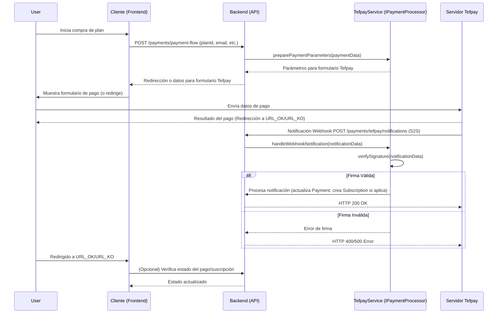

# Gestión de Pagos (PaymentsModule)

El `PaymentsModule` es responsable de todas las operaciones relacionadas con el procesamiento de pagos en la aplicación. Esto incluye la iniciación de pagos, la gestión de diferentes procesadores de pago, y el manejo de notificaciones de los mismos.

## Arquitectura

La arquitectura del módulo de pagos ha sido diseñada para ser flexible y soportar múltiples procesadores de pago de forma dinámica.

### Interfaz `IPaymentProcessor`

Se define una interfaz genérica `IPaymentProcessor` (`src/payments/processors/payment-processor.interface.ts`) que establece el contrato que deben cumplir todos los procesadores de pago. Actualmente, esta interfaz define el método `preparePaymentParameters` para obtener los datos necesarios para redirigir al usuario a la pasarela de pago.

```typescript
export interface PreparePaymentParams {
  amount: number; // En centavos o la unidad mínima de la moneda
  currency: string;
  order: string; // Referencia única del pedido en nuestro sistema
  merchant_data?: string; // Datos adicionales para el comerciante
  product_description?: string;
  customer_email?: string;
  success_url?: string; // URL a la que redirigir en caso de éxito
  cancel_url?: string; // URL a la que redirigir en caso de cancelación
  notification_url?: string; // URL para notificaciones del procesador (webhook)
  metadata?: Record<string, any>; // Metadatos adicionales
}

export interface PreparedPaymentResponse {
  url: string; // URL a la que redirigir al usuario o para mostrar en un iframe
  fields: Record<string, string>; // Campos a enviar si es un formulario POST
  payment_processor_name: string; // Nombre del procesador, ej: 'tefpay'
}

export interface IPaymentProcessor {
  preparePaymentParameters(
    params: PreparePaymentParams
  ): PreparedPaymentResponse;
  // Futuros métodos como handleWebhookNotification, processRefund, etc.
}
```

### Selección Dinámica del Procesador

El procesador de pago activo se determina en tiempo de ejecución basándose en la variable de entorno `ACTIVE_PAYMENT_PROCESSOR`.

- **`ACTIVE_PAYMENT_PROCESSOR`**: Esta variable de entorno especifica el nombre del procesador de pago que se utilizará. Por ejemplo, `ACTIVE_PAYMENT_PROCESSOR=tefpay`.
- **Valor por defecto**: Si la variable `ACTIVE_PAYMENT_PROCESSOR` no está definida, el sistema utilizará `"tefpay"` como procesador por defecto.

El `PaymentsModule` utiliza un _factory provider_ (`useFactory`) para inyectar la implementación correcta de `IPaymentProcessor` (a través del token `PAYMENT_PROCESSOR_TOKEN`) en el `PaymentsService`. La fábrica lee la variable de entorno `ACTIVE_PAYMENT_PROCESSOR` mediante `ConfigService` y devuelve la instancia del servicio del procesador correspondiente (ej. `TefpayService`).

El token de inyección `PAYMENT_PROCESSOR_TOKEN` es un `Symbol` definido en `src/payments/payment-processor.token.ts` para evitar colisiones de nombres.

### `PaymentsService`

El `PaymentsService` (`src/payments/payments.service.ts`) consume la interfaz `IPaymentProcessor` inyectada para realizar operaciones de pago, abstrayéndose de la implementación concreta del procesador.

El método `create` del `PaymentsService` también permite opcionalmente especificar un procesador de pago a través del campo `processor` en `CreatePaymentDto`. Si se proporciona, este procesador tendría precedencia sobre el configurado globalmente (esta funcionalidad está contemplada pero su implementación completa dependerá de la gestión de múltiples instancias de procesadores).

## Procesadores Implementados

Actualmente, el único procesador de pago implementado es:

- **Tefpay**: `TefpayService` (`src/payments/tefpay/tefpay.service.ts`) implementa `IPaymentProcessor` para interactuar con la pasarela de Tefpay.

## Configuración

Para configurar el módulo de pagos, asegúrate de que las siguientes variables de entorno estén definidas en tu archivo `.env`:

- `ACTIVE_PAYMENT_PROCESSOR`: (Opcional) El nombre del procesador de pago a utilizar (ej. `tefpay`). Si no se especifica, se usará `tefpay` por defecto.

Para cada procesador de pago, se requerirán variables de entorno específicas. Para **Tefpay**:

- `TEFPAY_MERCHANT_CODE`: Código de comerciante de Tefpay.
- `TEFPAY_SECRET_KEY`: Clave secreta para firmar y verificar las transacciones de Tefpay.
- `TEFPAY_FORM_URL`: URL del formulario de pago de Tefpay.
- `TEFPAY_DEFAULT_SUCCESS_URL`: URL a la que redirigir tras un pago exitoso (si no se especifica otra).
- `TEFPAY_DEFAULT_ERROR_URL`: URL a la que redirigir tras un pago fallido (si no se especifica otra).
- `TEFPAY_DEFAULT_CANCEL_URL`: URL a la que redirigir si el usuario cancela el pago (si no se especifica otra).
- `TEFPAY_TERMINAL`: Terminal de Tefpay a utilizar (por defecto '001').
- `APP_BASE_URL`: URL base de la aplicación, utilizada para construir URLs de notificación y retorno.

## Flujo de Notificaciones (Webhook)

El `PaymentsService` expone un método `handlePaymentNotification` que toma un `processorName` (ej. 'tefpay') y los datos de la notificación. Internamente, delega el manejo al servicio del procesador de pagos correspondiente (obtenido a través de la interfaz `IPaymentProcessor`).

### Servicios de Procesadores de Pago

Actualmente, el único procesador implementado es Tefpay (`TefpayService`). Este servicio implementa la interfaz `IPaymentProcessor`.

#### Interfaz `IPaymentProcessor`

La interfaz `IPaymentProcessor` define el contrato que todos los servicios de procesadores de pago deben implementar. Esto permite que `PaymentsService` y `SubscriptionsService` interactúen con diferentes procesadores de manera uniforme.

## Variables de Entorno

Para el correcto funcionamiento del módulo de pagos y sus procesadores, se deben definir varias variables de entorno en el archivo `.env`. A continuación se detallan las variables necesarias:

- `ACTIVE_PAYMENT_PROCESSOR`: (Opcional) El nombre del procesador de pago a utilizar (ej. `tefpay`). Si no se especifica, se usará `tefpay` por defecto.

Para **Tefpay**:

- `TEFPAY_MERCHANT_CODE`: Código de comerciante de Tefpay.
- `TEFPAY_SECRET_KEY`: Clave secreta para firmar y verificar las transacciones de Tefpay.
- `TEFPAY_FORM_URL`: URL del formulario de pago de Tefpay.
- `TEFPAY_DEFAULT_SUCCESS_URL`: URL a la que redirigir tras un pago exitoso (si no se especifica otra).
- `TEFPAY_DEFAULT_ERROR_URL`: URL a la que redirigir tras un pago fallido (si no se especifica otra).
- `TEFPAY_DEFAULT_CANCEL_URL`: URL a la que redirigir si el usuario cancela el pago (si no se especifica otra).
- `TEFPAY_TERMINAL`: Terminal de Tefpay a utilizar (por defecto '001').
- `APP_BASE_URL`: URL base de la aplicación, utilizada para construir URLs de notificación y retorno.

## Diagrama de Secuencia (Ejemplo: Flujo de Pago con Tefpay)



## Inyección de Dependencias y Módulos

El `PaymentsModule` ahora es global (`@Global()`) para facilitar la inyección del `IPaymentProcessor` en otros módulos, como `SubscriptionsModule`.

```typescript
// src/payments/payments.module.ts
import { Module, Global, forwardRef } from "@nestjs/common";
import { PaymentsController } from "./payments.controller";
import { PaymentsService } from "./payments.service";
import { TefpayService } from "./tefpay/tefpay.service";
import { PAYMENT_PROCESSOR_TOKEN } from "./payment-processor.token";
import { SubscriptionsModule } from "../subscriptions/subscriptions.module"; // Importación con forwardRef
import { TefpayNotificationsModule } from "./tefpay/notifications/notifications.module"; // Importación con forwardRef

@Global() // Hace el módulo global
@Module({
  imports: [
    // ... otros módulos ...
    forwardRef(() => SubscriptionsModule), // Resuelve dependencia circular
    forwardRef(() => TefpayNotificationsModule), // Resuelve dependencia circular
  ],
  controllers: [PaymentsController],
  providers: [
    PaymentsService,
    {
      provide: PAYMENT_PROCESSOR_TOKEN, // Token de inyección para IPaymentProcessor
      useClass: TefpayService, // Implementación por defecto (Tefpay)
    },
    // ... otros providers ...
  ],
  exports: [
    PaymentsService,
    PAYMENT_PROCESSOR_TOKEN, // Exporta el token para que otros módulos puedan inyectar IPaymentProcessor
  ],
})
export class PaymentsModule {}
```

## Flujo de Pago Típico

El siguiente diagrama ilustra el flujo completo de pagos y suscripciones, incluyendo la recepción de notificaciones S2S:

```mermaid
---
config:
  look: handDrawn
---
sequenceDiagram
    autonumber
    actor Usuario
    participant Frontend
    participant PaymentsController
    participant PaymentsService
    participant TefpayService
    participant SubscriptionsService
    participant TefpayNotificationsService
    participant AuditLogsService
    participant PrismaService
    participant Tefpay
    Usuario->>Frontend: Iniciar Pago (selecciona Plan)
    Frontend->>PaymentsController: POST /payments/payment-flow (plan_id, user_id, return_url)
    PaymentsController->>PaymentsService: initiatePayment(dto, userId)
    PaymentsService->>PrismaService: findFirst(Payment {user_id, status: PENDING})
    PrismaService-->>PaymentsService: existingPendingPayment
    alt Pago PENDIENTE Existente
        PaymentsService-->>PaymentsController: ConflictException("Ya tiene un pago pendiente")
        PaymentsController-->>Frontend: HTTP 409
        Frontend-->>Usuario: Error: "Pago pendiente existente"
    else Sin Pago PENDIENTE
        PaymentsService->>SubscriptionsService: findActiveSubscriptionByUserId(userId)
        SubscriptionsService-->>PaymentsService: activeSubscription
        alt Suscripción ACTIVA/TRIALING Existente
            PaymentsService-->>PaymentsController: ConflictException("Ya tiene una suscripción activa")
            PaymentsController-->>Frontend: HTTP 409
            Frontend-->>Usuario: Error: "Suscripción activa existente"
        else Sin Suscripción Activa
            PaymentsService->>PrismaService: findUnique(Plan {plan_id})
            PrismaService-->>PaymentsService: planDetails
            PaymentsService->>PrismaService: create(Payment {status: PENDING})
            PrismaService-->>PaymentsService: newPaymentRecord
            PaymentsService->>TefpayService: createTefpayRedirectFormParams(details)
            TefpayService-->>PaymentsService: tefpayParams (url, fields)
            PaymentsService->>AuditLogsService: create(AuditLog PAYMENT_INITIATED)
            AuditLogsService-->>PaymentsService: auditLogEntry
            PaymentsService-->>PaymentsController: InitiatePaymentResponseDto (payment_id, redirect_url, tefpay_form_inputs)
            PaymentsController-->>Frontend: HTTP 201 (InitiatePaymentResponseDto)
            Frontend-->>Usuario: Redirigir a tefpayParams.url con tefpayParams.fields
        end
    end
    Usuario->>Tefpay: Completa el pago en TPV
    Tefpay-->>Usuario: Resultado (redirige a return_url/cancel_url)
    Tefpay->>PaymentsController: POST /api/payments/tefpay/notifications
    note right of PaymentsController: Webhook para notificaciones S2S
    PaymentsController->>TefpayNotificationsService: storeRawNotification(payload)
    TefpayNotificationsService->>PrismaService: create(TefPayNotification {raw_notification, status: RECEIVED})
    PrismaService-->>TefpayNotificationsService: storedNotification
    TefpayNotificationsService->>PaymentsService: Event "tefpay.notification.processed_by_handler" (storedNotification)
    PaymentsService->>PaymentsService: handleTefpayNotificationEvent(storedNotification)
    PaymentsService->>TefpayService: verifyS2SSignature(rawPayload, signature)
    alt Firma Inválida
        TefpayService-->>PaymentsService: false
        PaymentsService->>TefpayNotificationsService: updateNotificationProcessingStatus(SIGNATURE_FAILED)
        PaymentsService->>AuditLogsService: update(AuditLog {error: "Signature failed"})
    else Firma Válida
        TefpayService-->>PaymentsService: true
        PaymentsService->>PrismaService: findUnique(Payment {matching_data})
        PrismaService-->>PaymentsService: paymentRecord
        alt Payment Record No Encontrado
            PaymentsService->>TefpayNotificationsService: updateNotificationProcessingStatus(ERROR, "Payment record not found")
            PaymentsService->>AuditLogsService: update(AuditLog {error: "Payment record not found"})
        else Payment Record Encontrado
            PaymentsService->>AuditLogsService: create(AuditLog PAYMENT_NOTIFICATION_RECEIVED)
            PaymentsService->>PaymentsService: mapTefpayNotificationToEventType(rawPayload)
            PaymentsService-->>PaymentsService: tefpayEventType
            alt Con Ds_Merchant_Subscription_Account (Suscripción)
                PaymentsService->>PaymentsService: processSubscriptionLifecycleEvent(simulatedEvent)
                loop Por cada tipo de evento
                    PaymentsService->>SubscriptionsService: findByProcessorSubscriptionId(tefpaySubscriptionAccount)
                    SubscriptionsService-->>PaymentsService: subscription
                    alt invoice.payment_succeeded (Renovación Exitosa)
                        PaymentsService->>PrismaService: create(Payment {status: COMPLETED, for_renewal})
                        PrismaService-->>PaymentsService: renewalPayment
                        PaymentsService->>PrismaService: update(Subscription {status: ACTIVE, new_period_end})
                        PaymentsService->>AuditLogsService: update(AuditLog {status: "ProcessedRenewalSuccess"})
                        PaymentsService->>TefpayNotificationsService: updateNotificationProcessingStatus(PROCESSED, payment_id, subscription_id)
                    else invoice.payment_failed (Renovación Fallida)
                        PaymentsService->>PrismaService: create(Payment {status: FAILED, for_renewal_attempt})
                        PrismaService-->>PaymentsService: failedPayment
                        PaymentsService->>PrismaService: update(Subscription {status: PAST_DUE})
                        PaymentsService->>AuditLogsService: update(AuditLog {status: "ProcessedRenewalFailure"})
                        PaymentsService->>TefpayNotificationsService: updateNotificationProcessingStatus(PROCESSED, payment_id, subscription_id)
                        note right of PaymentsService: TODO: Implementar lógica de dunning
                    else customer.subscription.deleted (Cancelación)
                        PaymentsService->>PrismaService: update(Subscription {status: CANCELLED, ended_at})
                        PaymentsService->>AuditLogsService: update(AuditLog {status: "ProcessedSubscriptionDeleted"})
                        PaymentsService->>TefpayNotificationsService: updateNotificationProcessingStatus(PROCESSED, subscription_id)
                    else Otros eventos (created, updated)
                        PaymentsService->>PrismaService: update/create(Subscription)
                        PaymentsService->>AuditLogsService: update(AuditLog {status: "ProcessedSubscriptionEvent"})
                        PaymentsService->>TefpayNotificationsService: updateNotificationProcessingStatus(PROCESSED, subscription_id)
                    end
                end
            else Sin Ds_Merchant_Subscription_Account (Pago Inicial)
                PaymentsService->>PaymentsService: processInitialPaymentEvent(rawPayload, paymentRecord)
                alt Pago Exitoso (Ds_Code < 100)
                    PaymentsService->>PrismaService: update(Payment {status: COMPLETED})
                    alt Plan con billing_interval (Suscripción)
                        PaymentsService->>SubscriptionsService: createFromPayment(details)
                        SubscriptionsService-->>PaymentsService: newSubscription
                        PaymentsService->>PrismaService: update(Payment {subscription_id})
                        PaymentsService->>AuditLogsService: update(AuditLog {status: "ProcessedSuccessfully", subscription_created_id})
                        PaymentsService->>TefpayNotificationsService: updateNotificationProcessingStatus(PROCESSED, payment_id, subscription_id)
                    else Pago Único
                        PaymentsService->>AuditLogsService: update(AuditLog {status: "ProcessedSuccessNonSubscription"})
                        PaymentsService->>TefpayNotificationsService: updateNotificationProcessingStatus(PROCESSED, payment_id)
                    end
                else Pago Fallido (Ds_Code >= 100)
                    PaymentsService->>PrismaService: update(Payment {status: FAILED})
                    PaymentsService->>AuditLogsService: update(AuditLog {status: "ProcessedWithFailure"})
                    PaymentsService->>TefpayNotificationsService: updateNotificationProcessingStatus(ERROR, payment_id, "Payment failed")
                end
            end
        end
    end
    note over Frontend, SubscriptionsService: Flujos de cancelación manual y renovación automática no están implementados en el código revisado, pero se asumen como futuros desarrollos.
```



1.  El frontend solicita iniciar un pago para un plan específico (`POST /api/payments/payment-flow`).
2.  `PaymentsService` utiliza el `IPaymentProcessor` inyectado para llamar a `preparePaymentParameters`.
3.  El procesador de pago (ej. `TefpayService`) prepara los datos necesarios (URL de redirección, campos de formulario) y los devuelve.
4.  `PaymentsService` devuelve estos datos al frontend.
5.  El frontend redirige al usuario a la pasarela de pago o envía el formulario.
6.  El usuario completa el pago en la pasarela externa.
7.  La pasarela de pago notifica al backend el resultado de la transacción a través de un webhook (ej. `POST /api/payments/tefpay/notifications`).
8.  El servicio de notificaciones correspondiente (ej. `TefPayNotificationsService`) recibe la notificación, la verifica y luego emite un evento interno. `PaymentsService` escucha este evento y utiliza sus métodos (`handleInitialPaymentOrSubscriptionNotification` o `handleSubscriptionLifecycleNotification`) para procesar la notificación, actualizar el estado del `Payment`, crear o actualizar la `Subscription` asociada, y ajustar los roles del `User` si es necesario. Esta lógica incluye el manejo de pagos iniciales, renovaciones, cancelaciones y fallos de pago.

## Estado Actual y Mejoras Recientes

La revisión exhaustiva del sistema de pagos, notificaciones (especialmente Tefpay), y la lógica de suscripciones y planes ha sido completada, abordando varios puntos críticos. Las mejoras y correcciones clave incluyen:

- **Verificación de Firmas de Webhooks**: Se ha implementado y validado la correcta verificación de las firmas S2S para las notificaciones de Tefpay, asegurando la autenticidad de los mensajes.
- **Manejo Detallado de Escenarios de Notificación**: Se ha refinado la lógica en `PaymentsService` para manejar diversos escenarios de notificación a través de los métodos `handleInitialPaymentOrSubscriptionNotification` y `handleSubscriptionLifecycleNotification`. Esto incluye:
  - La correcta creación y activación de suscripciones tras un pago inicial exitoso.
  - La gestión de renovaciones de suscripción, incluyendo el manejo de pagos fallidos y la posible transición de suscripciones a estados como `past_due` o `canceled`.
  - El procesamiento de cancelaciones de suscripción iniciadas por el usuario o por el sistema.
- **Resolución de Errores de Tipado y Dependencias**:
  - Se corrigió un error de "type never" en la función `processSubscriptionLifecycleEvent` dentro de `PaymentsService`. Esto se logró asegurando que la transacción de Prisma (`prisma.$transaction`) devuelva explícitamente un objeto con las entidades `Payment` y `Subscription` (o `null`), permitiendo una inferencia de tipos correcta para las variables `finalFailedRenewalPayment` y `finalSubscriptionForNotification`.
  - Se corrigió el nombre de la propiedad `cancelled_at` a `canceled_at` al actualizar el estado de una `Subscription` para alinearlo con el esquema de Prisma.
  - Se resolvieron las excepciones `UnknownDependenciesException` (para `TefpayService` en `SubscriptionsModule`) y `UndefinedModuleException` (debido a una dependencia circular entre `PaymentsModule` y `SubscriptionsModule`) mediante la importación de `PaymentsModule` en `SubscriptionsModule` y la aplicación de `forwardRef()` en las importaciones de módulos en ambos `subscriptions.module.ts` y `payments.module.ts`.
- **Atomicidad de Operaciones**: El uso de `prisma.$transaction` en operaciones críticas asegura que las actualizaciones en múltiples tablas (como `Payment`, `Subscription`, `User`) se realicen de manera atómica.

Estos cambios han mejorado significativamente la robustez, fiabilidad y correctitud del módulo de pagos y su interacción con las suscripciones.
